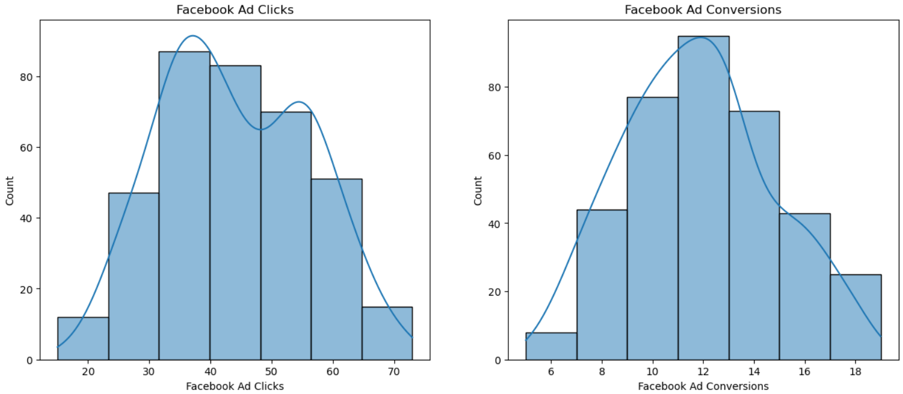
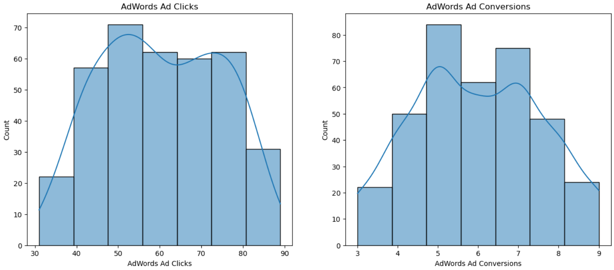
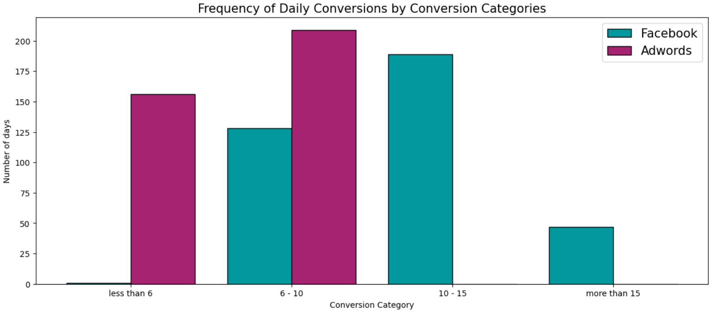
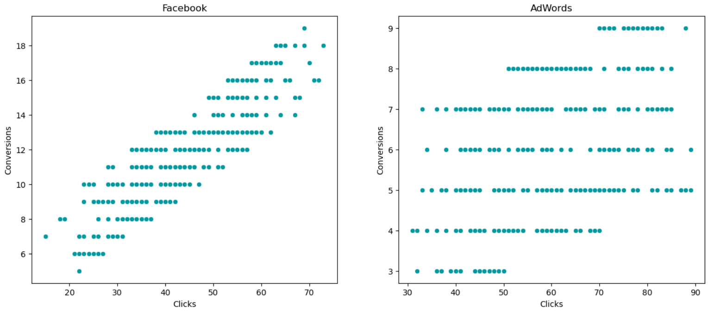
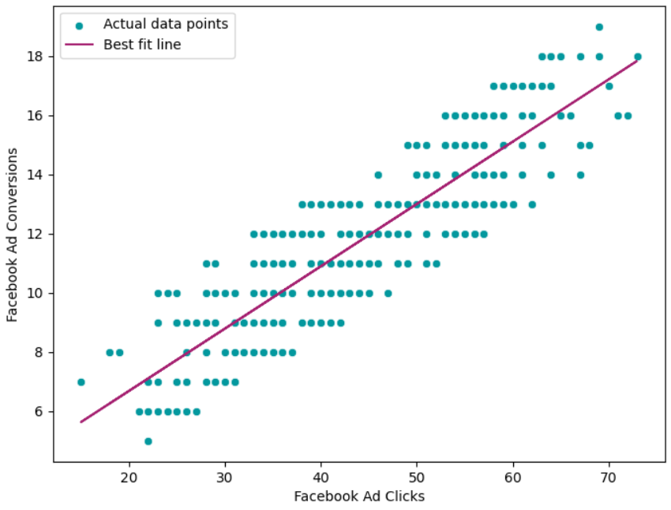
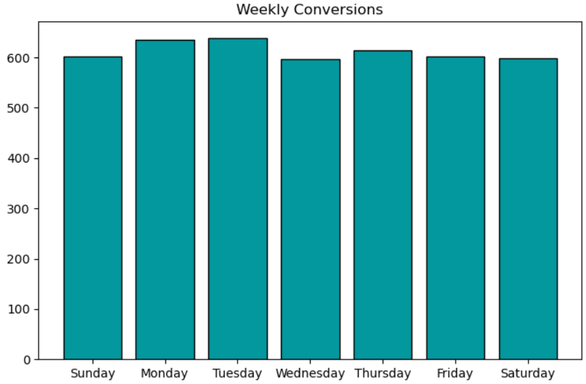
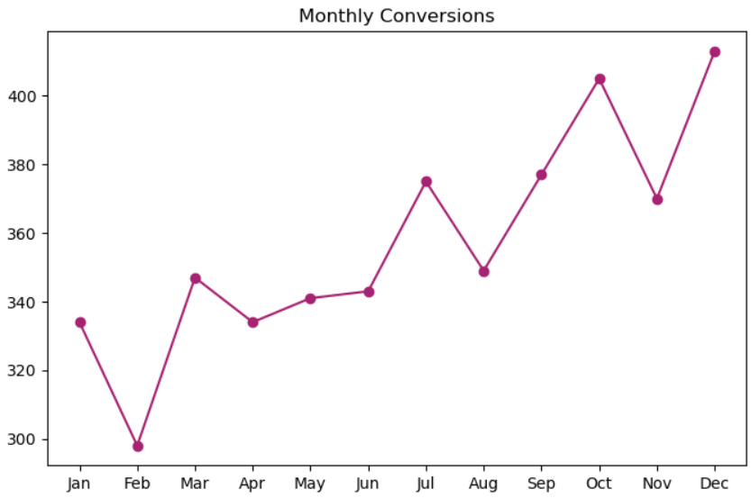
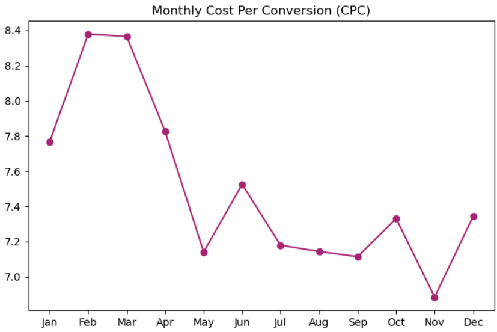

# 📊 A/B Testing & Regression Analysis – Marketing Campaigns

## 📌 Project Overview

This project compares the performance of two advertising platforms — **Facebook Ads** and **AdWords Ads** — to determine which delivers better results in terms of **clicks, conversions, and cost-effectiveness**.

It combines **A/B testing, statistical analysis, and regression modeling** to generate actionable marketing insights.

---

## 🎯 Business Objective

* Identify the more effective advertising platform
* Optimize ROI for marketing campaigns
* Improve conversion rates and cost efficiency
* Support data-driven budget allocation

---

## 📂 Dataset Description

* Daily campaign data for the year **2019 (365 records)**
* Covers both **Facebook Ads** and **AdWords Ads**

### Key Features:

* Date
* Ad Views
* Ad Clicks
* Ad Conversions
* Cost per Ad
* Click-Through Rate (CTR)
* Conversion Rate
* Cost per Click (CPC)

---

## 🧹 Data Preprocessing

* Converted date column to datetime
* Cleaned percentage and currency values
* Filtered and structured campaign-specific datasets
* Prepared features for statistical and regression analysis

---

## 📊 Exploratory Data Analysis (EDA)

* Distribution analysis of clicks and conversions
* Conversion category segmentation
* Comparison of high vs low conversion days
* Scatter plots to analyze relationships

### Key Insight:

* Facebook shows **more frequent high-conversion days** compared to AdWords

---

## ⚖️ Comparing Campaigns Performance

This section compares **Facebook Ads vs AdWords Ads** to evaluate which platform performs better across key marketing metrics.

### 🔍 Key Comparisons:

* Distribution of **clicks and conversions**
* Frequency of **high vs low conversion days**
* Overall campaign performance patterns
* Consistency in generating conversions
* Identification of outliers and variability

### 📊 Key Insights:

* Facebook shows **more consistent and higher conversions**
* AdWords has **lower and more variable performance**
* Facebook has **more high-conversion days**
* AdWords mostly falls in **low to moderate conversion range**
* Performance distribution is more **balanced in Facebook campaigns**

### 💡 Business Impact:

* Helps identify the **better-performing platform**
* Supports **budget reallocation decisions**
* Highlights areas for **AdWords optimization**
* Improves overall **marketing strategy effectiveness**

  

  

  

  

---

## 🔗 Correlation Analysis

* **Facebook:** Strong positive correlation (0.87)
* **AdWords:** Moderate correlation (0.45)

👉 **Conclusion:** Clicks drive conversions much more effectively on Facebook

---

## 🧪 A/B Testing (Hypothesis Testing)

### Hypothesis:

* **H0:** Facebook ≤ AdWords conversions
* **H1:** Facebook > AdWords conversions

### Results:

* Facebook Mean Conversions: **11.74**
* AdWords Mean Conversions: **5.98**
* p-value: **~0 (statistically significant)**

👉 **Conclusion:** Facebook significantly outperforms AdWords

---

## 📈 Regression Analysis

* Model: **Linear Regression (Facebook Clicks → Conversions)**
* R² Score: **76.35%**
* Strong predictive relationship between clicks and conversions

### Example Predictions:

* 50 clicks → ~Expected conversions
* 80 clicks → Higher expected conversions

👉 Useful for **forecasting campaign performance**

  

---

Add this section **after Regression Analysis (before Conclusion or wherever you prefer):**

---

## ⏱️ Analyzing Facebook Campaign Metrics Over Time

This section focuses on understanding how Facebook ad performance evolves over time using **time-based analysis**.

### 🔍 Key Analysis Performed:

* Weekly conversion trends to identify best-performing days
* Monthly conversion patterns to detect seasonality
* Cost Per Conversion (CPC) trend analysis
* Identification of high and low performance periods
* Cointegration analysis between ad spend and conversions

### 📈 Key Insights:

* Higher conversions observed on **Mondays and Tuesdays**
* Overall **upward trend** in monthly conversions
* Certain months show **seasonal dips in performance**
* **CPC remains stable**, with lowest cost in May & November
* Strong **long-term relationship between cost and conversions**

### 💡 Business Impact:

* Helps optimize **campaign timing and budget allocation**
* Identifies **high ROI periods**
* Supports **long-term marketing strategy planning**
  

  

  

  

---

## 📅 Time Series Insights

### Weekly Trends:

* Higher conversions on **Monday & Tuesday**

### Monthly Trends:

* Overall increasing trend
* Lower performance in some months due to seasonality

---

## 💰 Cost Analysis

### Cost Per Conversion (CPC):

* Stable overall trend
* Lowest in **May & November**
* Highest in **February**

👉 Suggests **optimal months for budget allocation**

---

## 🔄 Cointegration Analysis

* Strong long-term relationship between:

  * **Ad Spend**
  * **Conversions**

👉 Indicates stable ROI behavior over time

---

## 📊 Key Findings

* Facebook is significantly more effective than AdWords
* Strong relationship between clicks and conversions (especially Facebook)
* Certain time periods offer better ROI
* Budget allocation can be optimized using data trends

---

## ✅ Recommendations

* Increase investment in **Facebook Ads**
* Optimize AdWords strategy (targeting, creatives)
* Allocate higher budget during **low CPC months**
* Use regression model for **conversion forecasting**
* Focus campaigns early in the week for better engagement

---

## 🏁 Conclusion

This project demonstrates how **A/B testing and regression analysis** can be used to evaluate marketing performance, optimize ad spend, and improve business decision-making through data-driven insights.

---

## 🛠️ Tools & Technologies

* Python
* Pandas, NumPy
* Matplotlib, Seaborn
* Scikit-learn
* SciPy (Hypothesis Testing)
* Statsmodels (Time Series & Cointegration)

---

## 📂 How to Use

1. Clone the repository
2. Add dataset (`marketing_campaign.csv`)
3. Run the notebook/script
4. Explore visualizations and insights
5. Modify parameters for further analysis

---

